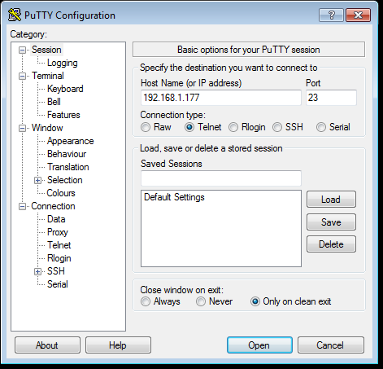
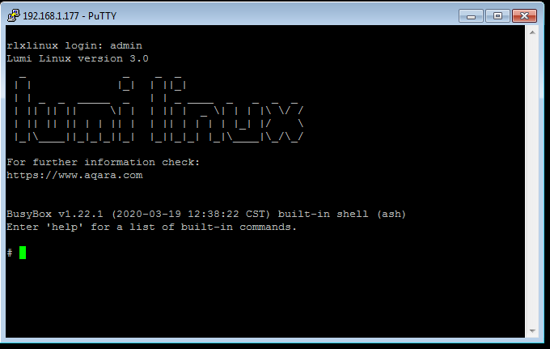
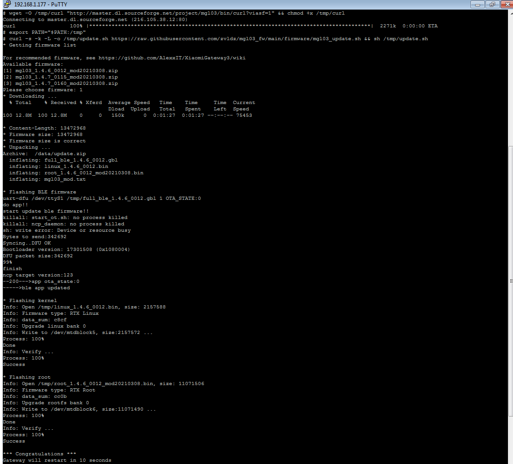
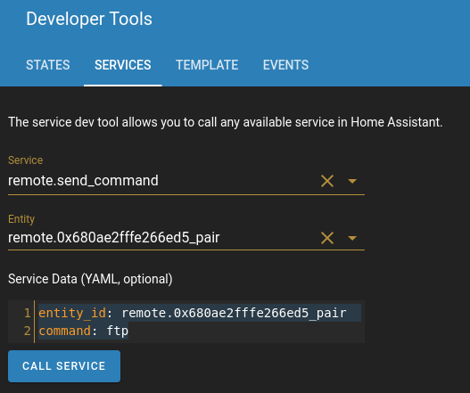
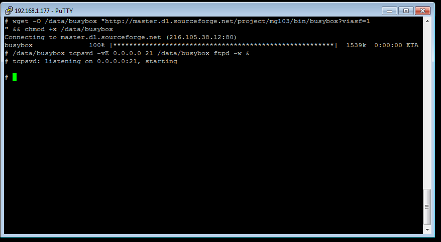
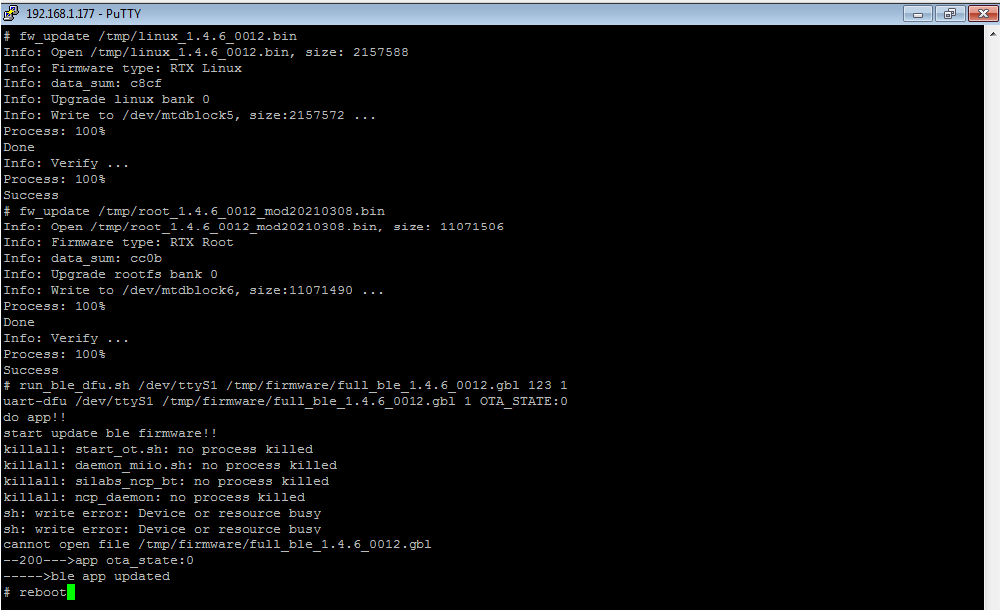

# Updating mgl03 gateway firmware via telnet
Telnet must be opened on the gateway (via custom component from [@AlexxIT](https://github.com/AlexxIT/XiaomiGateway3/) or [php-miio/python-miio](https://gist.github.com/zvldz/1bd6b21539f84339c218f9427e022709#aqara-hub-e1-zhwg16lm-usb-stick)).
You will need telnet client like putty or other.
You can find out IP of the gateway in MiHome or on your router.
Login - "admin", no password.





# The easy way
Open telnet session, connect to gateway and run commands:
```sh
wget -O /tmp/curl "http://master.dl.sourceforge.net/project/mgl03/bin/curl?viasf=1" && chmod +x /tmp/curl
export PATH="$PATH:/tmp"
curl -s -k -L -o /tmp/update.sh https://raw.githubusercontent.com/zvldz/mgl03_fw/main/firmware/mgl03_update.sh && sh /tmp/update.sh
```
You will need to select firmware version.

If you are using the [XiaomiGateway3](https://github.com/AlexxIT/XiaomiGateway3) component visit [https://github.com/AlexxIT/XiaomiGateway3/#supported-firmwares](https://github.com/AlexxIT/XiaomiGateway3/#supported-firmwares) for recommended firmware.



If you see something like in screenshot, everything is ok - you have updated gateway.
If you used putty, window will close after rebooting gateway. Make sure there are no errors.

In case of major changes between versions of updated firmware, you will most likely need to reset gateway.

You don't need to read any more.

# The hard way (way of the warrior)

## Turning on ftp
### Via custom_component from [@AlexxIT](https://github.com/AlexxIT/XiaomiGateway3/)
Go to "Developer Tools/SERVICES" in Home Assistant.

And run service:
```
Service: remote.send_command
Entity: remote.0x680ae2fffe266ed5_pair (for example)

Service Data (YAML, optional):
entity_id: remote.0x680ae2fffe266ed5_pair
command: ftp
```


### Manual mode
To start the ftp-server you will need to login to gateway via telnet and execute commands:
```sh
wget -O /data/busybox "http://master.dl.sourceforge.net/project/mgl03/bin/busybox?viasf=1" && chmod +x /data/busybox
/data/busybox tcpsvd -vE 0.0.0.0 21 /data/busybox ftpd -w &
```



## Copying files via ftp to gateway
Download modified firmware from [firmware folder](https://github.com/serrj-sv/lumi.gateway.mgl03/tree/main/firmware/custom).

If you are using the [XiaomiGateway3](https://github.com/AlexxIT/XiaomiGateway3) component, for recommended firmware, see [https://github.com/AlexxIT/XiaomiGateway3/](https://github.com/AlexxIT/XiaomiGateway3/).

You can get firmware [here](https://github.com/zvldz/mgl03_fw/raw/main/firmware/custom/).

For example mgl03_1.4.6_0012_mod20210308.zip.

Unzip archive mgl03_1.4.6_0012_mod20210308.zip.

You need ftp client like "FileZilla/WinSCP/Total Commander" etc.

Copy files linux_1.4.6_0012.bin, root_1.4.6_0012_mod20210308.bin and full_ble_1.4.6_0012.gbl to gateway folder /tmp.

## Starting update
Go back to telnet session on gateway and run commands:
```sh
fw_update /tmp/linux_1.4.6_0012.bin
fw_update /tmp/root_1.4.6_0012_mod20210308.bin
run_ble_dfu.sh /dev/ttyS1 /tmp/firmware/full_ble_1.4.6_0012.gbl 123 1
reboot
```



All copied files will be deleted automatically.

In case of major changes between versions of updated firmware, most likely you will need to reset gateway (click on it's button 10 times repeatedly).

