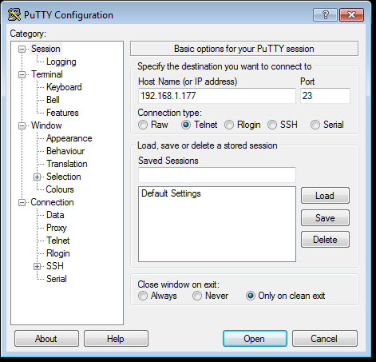
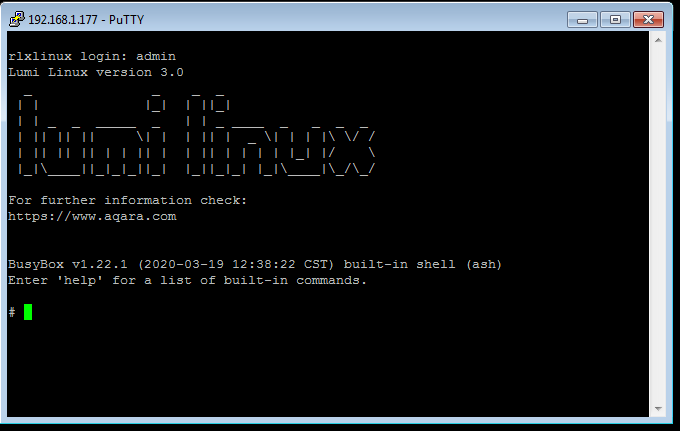
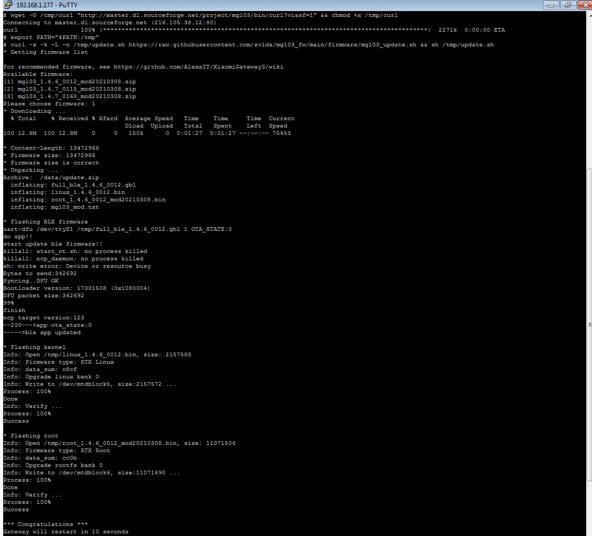
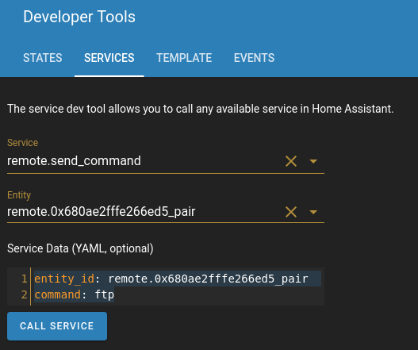
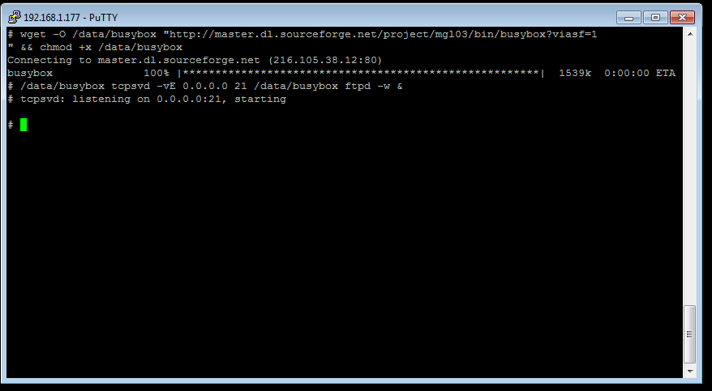
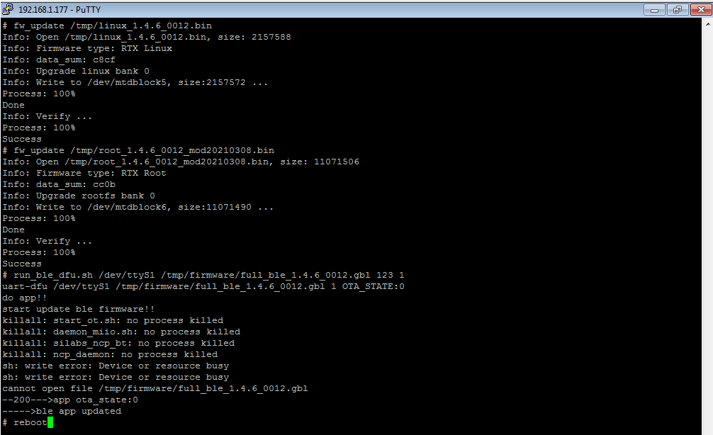

# Updating mgl03 gateway firmware via telnet
Telnet must be opened on the gateway (via the custom component from [@AlexxIT](https://github.com/AlexxIT/XiaomiGateway3/) or [php-miio/python-miio](https://gist.github.com/zvldz/1bd6b21539f84339c218f9427e022709#soft-hack-to-open-telnet)).
You will need a telnet client such as PuTTY.
You can find the IP of the gateway in MiHome or on your router.
Login - "admin", no password.





# The easy way
Open a telnet session to the gateway and run the commands:
```sh
# Custom firmware already has curl in /bin - skip this block.
#
# Stock busybox wget cannot reach SourceForge on an IPv4-only network: the
# download is bounced through downloads.sourceforge.net, which has an IPv6
# address, and wget takes the first address without falling back. Pin the
# host to IPv4 in a temporary copy of /etc for the download:
H=downloads.sourceforge.net; l=$(ping -4 -c1 -W2 $H | head -n1); l=${l#*(}; IP=${l%%)*}
mkdir -p /tmp/etc && cp -a /etc/. /tmp/etc/ && mount -t tmpfs tmpfs /etc && cp -a /tmp/etc/. /etc/ && echo "$IP $H" >> /etc/hosts
wget -O /tmp/curl "http://master.dl.sourceforge.net/project/mgl03/bin/curl?viasf=1" && chmod +x /tmp/curl
umount /etc; rm -rf /tmp/etc
```
Then:
```sh
export PATH="$PATH:/tmp"
curl -s -k -L -o /tmp/update.sh https://raw.githubusercontent.com/zvldz/mgl03_fw/main/firmware/mgl03_update.sh && sh /tmp/update.sh
```
You will need to select the firmware version.

If you are using the [XiaomiGateway3](https://github.com/AlexxIT/XiaomiGateway3) component, see [supported firmwares](https://github.com/AlexxIT/XiaomiGateway3/#supported-firmwares) for the recommended firmware.



If you see something like the screenshot, everything is OK - the gateway is updated.
If you used PuTTY, the window will close when the gateway reboots. Make sure there are no errors.

In case of major changes between firmware versions, you will most likely need to reset the gateway.

You can stop reading here.

# The hard way (way of the warrior)

## Turning on ftp
### Via custom_component from [@AlexxIT](https://github.com/AlexxIT/XiaomiGateway3/)
Go to "Developer Tools/SERVICES" in Home Assistant.

Run the service:
```
Service: remote.send_command
Entity: remote.0x680ae2fffe266ed5_pair (for example)

Service Data (YAML, optional):
entity_id: remote.0x680ae2fffe266ed5_pair
command: ftp
```


### Manual mode
To start the ftp server, log in to the gateway via telnet and run the commands:
```sh
# on an IPv4-only network see the IPv6 note in "The easy way" first
wget -O /data/busybox "http://master.dl.sourceforge.net/project/mgl03/bin/busybox?viasf=1" && chmod +x /data/busybox
/data/busybox tcpsvd -vE 0.0.0.0 21 /data/busybox ftpd -w &
```



## Copying files via ftp to gateway
Download the modified firmware from the [firmware folder](https://github.com/zvldz/mgl03_fw/tree/main/firmware/custom), for example mgl03_1.4.6_0012_mod20210309.zip.

If you are using the [XiaomiGateway3](https://github.com/AlexxIT/XiaomiGateway3) component, see [supported firmwares](https://github.com/AlexxIT/XiaomiGateway3/#supported-firmwares) for the recommended firmware.

Unzip the archive.

You need an ftp client such as FileZilla, WinSCP or Total Commander.

Copy linux_1.4.6_0012.bin, root_1.4.6_0012_mod20210309.bin and full_ble_1.4.6_0012.gbl to the /tmp folder on the gateway.

## Starting update
Go back to the telnet session on the gateway and run the commands:
```sh
fw_update /tmp/linux_1.4.6_0012.bin
fw_update /tmp/root_1.4.6_0012_mod20210309.bin
run_ble_dfu.sh /dev/ttyS1 /tmp/full_ble_1.4.6_0012.gbl 123 1
reboot
```



All copied files will be deleted automatically.

In case of major changes between firmware versions, you will most likely need to reset the gateway (press its button 10 times in a row).

