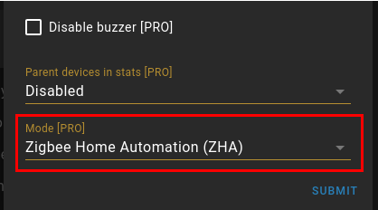
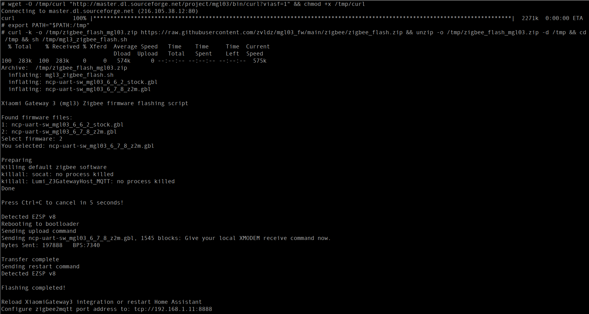

# Updating zigbee firmware of mgl03 gateway via telnet for Zigbee2MQTT
Telnet must be opened on the gateway (via the custom component from [@AlexxIT](https://github.com/AlexxIT/XiaomiGateway3/) or [php-miio](https://github.com/skysilver-lab/php-miio)/[python-miio](https://github.com/rytilahti/python-miio)).
You will need a telnet client such as PuTTY.
You can find the IP of the gateway in MiHome or on your router.
Login - "admin", no password.


## The easy way
If you are using [Home Assistant](https://www.home-assistant.io/), enable ZHA mode in the [XiaomiGateway3](https://github.com/AlexxIT/XiaomiGateway3) component and reboot the gateway.



Open a telnet session to the gateway and run the commands:
```sh
# Custom firmware already has curl in /bin - skip this block.
#
# Stock busybox wget cannot reach SourceForge on an IPv4-only network: the
# download is bounced through downloads.sourceforge.net, which has an IPv6
# address, and wget takes the first address without falling back. Pin the
# host to IPv4 in a temporary copy of /etc for the download:
H=downloads.sourceforge.net; l=$(ping -4 -c1 -W2 $H | head -n1); l=${l#*(}; IP=${l%%)*}
mkdir -p /tmp/etc && cp -a /etc/. /tmp/etc/ && mount -t tmpfs tmpfs /etc && cp -a /tmp/etc/. /etc/ && echo "$IP $H" >> /etc/hosts
wget -O /tmp/curl "http://master.dl.sourceforge.net/project/mgl03/bin/curl?viasf=1" && chmod +x /tmp/curl
umount /etc; rm -rf /tmp/etc
```
Then:
```sh
export PATH="$PATH:/tmp"
curl -s -k -L -o /tmp/zigbee_flash.zip https://raw.githubusercontent.com/zvldz/mgl03_fw/main/zigbee/zigbee_flash.zip && unzip -o /tmp/zigbee_flash.zip -d /tmp && cd /tmp && sh /tmp/mgl3_zigbee_flash.sh
```
You will need to select the firmware version:
  * ncp-uart-sw_mgl03_6_7_10_z2m.gbl for Zigbee2MQTT (recommended)
  * ncp-uart-sw_mgl03_6_7_8_z2m.gbl for Zigbee2MQTT
  * ncp-uart-sw_mgl03_6_6_2_stock.gbl to return to the stock firmware



If you see something like the screenshot, everything is OK - the zigbee firmware is updated and you can configure Zigbee2MQTT.

Example of the relevant part of the Zigbee2MQTT config:
```yaml
serial:
    adapter: ezsp
    port: 'tcp://192.168.1.177:8888'
```
For the add-on, configure the adapter via the UI.


Attention! Once you have installed the custom zigbee firmware, you will not be able to upgrade the gateway via the MiHome app. Only custom firmware upgrades are available in this case.


To return the gateway to MiHome, flash the stock firmware (ncp-uart-sw_mgl03_6_6_2_stock.gbl) and turn off ZHA mode.


Script author **[@CODeRUS](https://github.com/CODeRUS)**

Firmware for Zigbee2MQTT compiled by **Alexander Faronov** ([@faronov](https://github.com/faronov))
